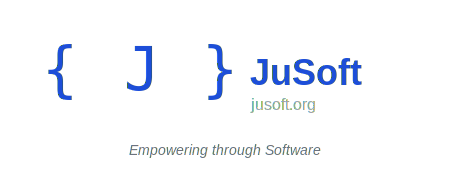

# 

## Welcome to JuSoft!

**JuSoft** is a software organization established in early 2025. We specialize in developing both open-source and proprietary software solutions primarily in **C#** and the **.NET** platform. Our core projects include system utilities designed to assist users in diagnosing system issues, logging events, and performing real-time monitoring tasks, as well as robust Software-as-a-Service (SaaS) solutions leveraging Web APIs and .NET MVC frameworks.

---

## 🔍 About Our Projects

At **JuSoft**, our primary focus is on creating **accessible, scalable, and reliable software tools**. Our key solutions encompass:

- **System diagnostics and analysis**
- **Event logging and reporting**
- **System monitoring and alerting**
- **Web-based SaaS solutions** (utilizing .NET MVC and Web API)

Additionally, we aim to empower **small and medium-sized enterprises (SMEs)** by providing essential software solutions. Many SMEs struggle due to outdated or insufficient software tools - Our mission is to bridge that gap, significantly enhancing their operational efficiency and competitive advantage.

---

## 🚀 Our Mission

We strongly believe in:

> "Empowering businesses and individuals through innovative, reliable, and accessible software solutions."

Our ultimate goal is to support those who are unable to access complex and costly solutions provided by larger corporations. By offering tailored alternatives, particularly through SaaS models, we help businesses grow, thrive, and compete effectively in today's demanding environment.

---

## 🤝 Join Our Team

We are actively seeking passionate individuals to join our growing team! If you're experienced or interested in:

- **C# / ASP.NET** (Core and Framework)
- **Web APIs & .NET MVC**
- **Python**
- **Bootstrap & JavaScript**
- Modern frontend frameworks (Web, Desktop, Mobile apps)

...we would love to hear from you!

We're especially open to creative individuals looking for a supportive environment to realize their innovative project ideas. If you've got an idea you've always wanted to develop but lacked the necessary resources or collaborators—**JuSoft** is the perfect place to make it happen.

---

## 📫 Contact & Collaboration

Interested in contributing, joining, or collaborating? Feel free to reach out!

- **Email:** [contact@jusoft.org](mailto:contact@jusoft.org)
- **Website:** [JuSoft.ORG](https://jusoft.org)

---

*Together, let's create meaningful software that truly makes a difference.*

### © 2025 JuSoft – Empowering through Software

